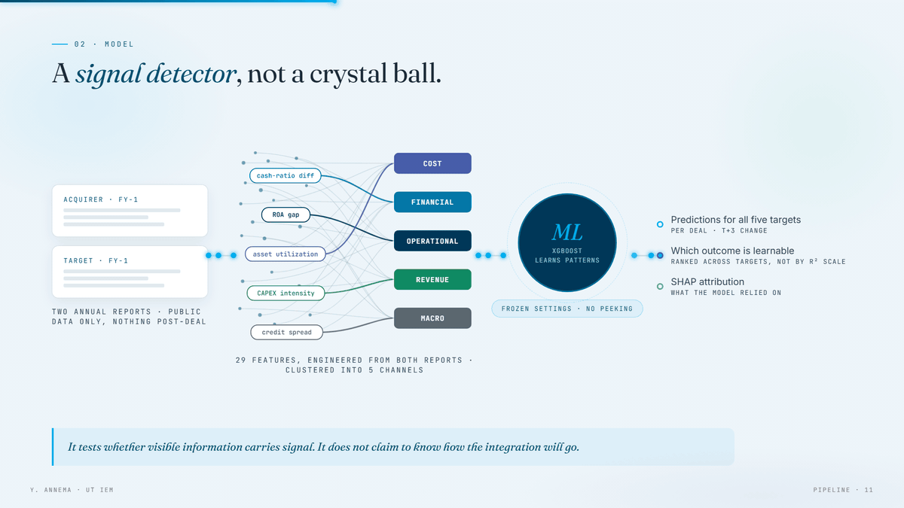
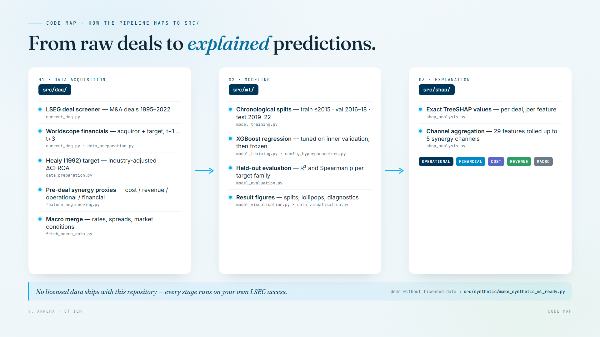

# Predicting post-merger operating performance with interpretable ML

[-1f6feb)](https://purl.utwente.nl/essays/110659)
[](https://yanickannema.github.io/post-merger-operating-performance-ml/presentation/)
[](requirements.txt)
[](src/ml)
[](LICENSE)

Code companion for my MSc thesis, *Predicting Post-Merger Operating Performance Across Alternative M&A Outcome Measures*, University of Twente, 2026.

The thesis studies whether pre-deal firm and transaction information can predict post-merger operating performance. The empirical pipeline builds a deal-level dataset from LSEG/Worldscope, constructs pre-deal synergy proxies, trains XGBoost models under chronological validation, and explains feature and channel contributions with SHAP.

**Full thesis:** https://purl.utwente.nl/essays/110659

## Headline result

Predicting post-merger operating performance from pre-deal information is hard — and the thesis quantifies exactly how hard, instead of overclaiming.

| Model (test set 2019–2022) | R² | Spearman ρ |
|---|---:|---:|
| Baseline Healy CFROA model | 0.0221 | 0.1609 |
| + Pompe-Bilderbeek distress ratios | 0.0296 | 0.1975 |
| Asset-turnover target (alternative outcome) | 0.1167 | 0.2761 |

The honest takeaway: pre-deal data carries a weak but real rank-ordering signal for post-merger performance, and SHAP shows it is concentrated in operational and financial channels rather than classic revenue-synergy stories. See `docs/extensions.md` for the full robustness table.

## The thesis in 46 seconds

A short explainer video of the research question, the model, and the screening app built on top of it: [`assets/thesis-video.mp4`](assets/thesis-video.mp4)

https://github.com/user-attachments/assets/55aa97db-f9f2-4887-9a35-fb1fad62c0ec

## Defense deck

**[▶ Open the interactive deck](https://yanickannema.github.io/post-merger-operating-performance-ml/presentation/)** — six key slides previewed below: pipeline, sample construction, chronological validation, the central result, and the SHAP story.

[](https://yanickannema.github.io/post-merger-operating-performance-ml/presentation/)

The deck source lives in [`presentation/`](presentation/) (arrow keys to navigate, `a` for the appendix). All figures show aggregate results only; row-level data and SHAP matrices are not redistributed.

## Code map

How the pipeline maps to the source folders in this repository:



## What is included

- `src/daq/`: data acquisition, feature engineering, macro merge, and diagnostic scripts.
- `src/ml/`: XGBoost training, validation, evaluation, and model visualisation.
- `src/shap/`: SHAP feature and channel attribution pipeline.
- `src/synthetic/`: small synthetic-data helper for local demos without licensed data.
- `presentation/`: the interactive defense deck (single HTML file, 28 slides + Q&A appendix).
- `docs/data_policy.md`: what can and cannot be redistributed.
- `docs/extensions.md`: public-safe summary of the extension and robustness studies.
- `docs/visual_companion.md`: why selected visuals are included but full presentation/dashboard folders are not.

## What is not included

The underlying LSEG/Worldscope data, ORBIS exports, derived deal-level datasets, caches, trained model artifacts, and SHAP matrices are not redistributed. They are proprietary inputs, licensed-derived files, or usage-restricted materials. The repository is intended to share the research code, aggregate visuals, and reproducibility structure, not the vendor data.

## Repository layout

```text
post-merger-operating-performance-ml/
  assets/
    readme/
  presentation/
    figs/
  src/
    daq/
    ml/
    shap/
    synthetic/
  data/       ignored, except .gitkeep
  outputs/    ignored, except .gitkeep
  config/     ignored, except .gitkeep
  docs/
  requirements.txt
  LICENSE
```

## Reproducing with licensed data

1. Install dependencies: `pip install -r requirements.txt`.
2. Configure your own LSEG/Workspace access locally. Do not commit config files.
3. Run the DAQ scripts in `src/daq/` to create the intermediate files expected by the ML scripts.
4. Run `src/ml/model_training.py`, then `src/ml/model_evaluation.py` and `src/shap/shap_analysis.py`.

Paths in the original thesis scripts assume the local thesis project layout. Before making this repo fully reproducible, replace those paths with a small project-root config layer.

## Data note

The public repository should only contain code, metadata, documentation, and synthetic examples. LSEG/Worldscope data and any licensed-derived data remain private. See `docs/data_policy.md`.

## License

Code is released under the MIT License. Data is not included.
